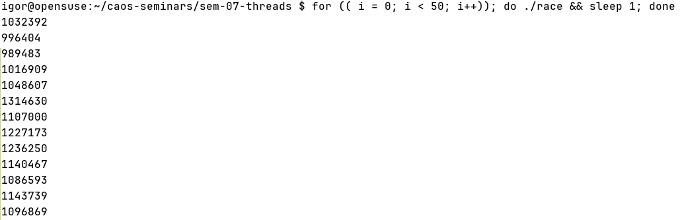

# Потоки

Большинство современных систем - многоядерные. В хорошем сервере в среднем 128-256 ядер, их нужно эффективно *утилизировать*. Если задача, решаемая на компьютере, является **CPU-bound** (т.е. в основном расходуются ресурсы CPU), появляется желание *распараллелить её*, то есть выполнить физически на разных ядрах.

Другая ситуация - **Network-bound** задачи, например, сетевое приложение с более чем 10K RPS (requests per second). Если исполнение одно, обработка одного клиента блокирует остальных клиентов: чтение из сокета (см. семинар 9) в общем случае блокирующее. В данном случае появляется желание *шардировать* множество клиентов, и каждому потоку выдать своё подмножество. Тогда мы сможем одновременно обрабатывать K клиентов, где K - число запущенных потоков.

Для этого существует примитив **поток** (другое название - **нить**). Потоки в одной группе имеют общие виртуальное адресное пространство, глобальные переменные и кучу, но каждый поток имеет собственный стек для локальных переменных.

Хоть потоки и реализуются поверх основного интерфейса ОС, многопоточные программы должны быть *переносимыми*, поэтому интерфейс потоков описан в стандарте POSIX (отсюда `pthread` = POSIX thread). Согласно POSIX, процесс логически состоит из потоков, но фактически в Linux поток - такая же единица планирования, как и процесс, а TID'ы (Thread ID) выделяются из того же множества, что и PID'ы. Иными словами, в Linux разница между процессом и потоком довольно расплывчатая.

Конечно, эти задачи можно решать и с помощью набора процессов, однако передача информации между процессами требует дополнительных приседаний. Потоки - более гибкий инструмент, поскольку они делят одно виртуальное адресное пространство, таблицу файловых дескрипторов, действия сигналов и др.

### API работы с потоками POSIX

**NPTL** - библиотека, реализующая POSIX-потоки, наиболее часто используемая в Linux.

1) `int pthread_create(pthread_t* thread, const pthread_attr_t* attr, void* (*start)(void*), void* arg)` - создание потока, который будет выполнять функцию `start` с аргументом `arg`; в `attr` указываются дополнительные аттрибуты потока (можно передать `NULL`); `thread` инициализируется идентификатором потока
2) `void pthread_exit(void* retval)` - независимое завершение потока с возвращаемым значением `retval`
3) `int pthread_join(pthread_t thread, void** retval)` - ждёт завершения потока с идентификатором `thread`
4) `int pthread_detach(pthread_t thread)` <br>
    Как и с процессами, если не сделать на потоке `pthread_join` (аналог `wait`), поток превращается в аналог процесса-зомби, его ресурсы не будут освобождаться. Это делается для того, чтобы после завершения потока узнать его `retval`. <br>
    С помощью `pthread_detach` указывается, что ресурсы потока должны быть освобождены сразу после его завершения.
5) `pthread_t pthread_self(void)` - возвращает идентификатор текущего потока
6) `int pthread_equal(pthread_t t1, pthread_t t2)` - сравнивает два идентификатора потока

### Параллельные инкременты
В файле [race.c](race.c) представлен первый простой пример - 1 млн. инкрементов общей переменной в двух потоках. Выполним и посмотрим, что выходит:
<details>
  <summary> Картинка </summary> <br>

  
</details> <br>

Выходит лажа, совсем не 2 млн. Почему? А мы посмотрим, что получается в ассемблере:

```
mov rax, [counter]
add rax, 1
mov [counter], rax
```

Сложение может работать с памятью напрямую (свертесь с ISDM), но компилятор сгенерировал именно такой код.
> Поищите причину, почему компилятор не сгенерировал `add [counter], 1`.

Вообще, результат работы программы согласуется с нашим (пока что наивным) представлением о *модели памяти* x86: у каждого ядра свой набор регистров; два потока могли выполнить загрузку из памяти одновременно, из-за чего один инкремент теряется.

Однако, даже если мы перепишем программу с `add [counter], 1`, результат всё равно не будет 2 млн. Оказывается, этот спецэффект связан с откладыванием обновлений кэшей на ядрах (см. Store buffer).
<details>
  <summary> Картинка </summary> <br>

  
</details> <br>

Подробне смотрите TODO и TODO, а также на курсе Concurrency в следующем семестре.

Для обхода таких ограничений в языке C есть примитив **атомиков** - участков памяти, обращение к которым происходит как бы "за одну инструкцию" (а на деле сопровождается сбросом store buffer'а).

### Атомики

Атомарным может быть тип размером не более машинного слова (то есть 64 бита на x86-64). Чтобы объявить переменную атомарной, к типу нужно приписать спецификатор `_Atomic` (см. пример в [atomic.c](atomic.c)).
<details>
  <summary> Клик </summary> <br>

  Попробуем посмотреть, что выходит в ассемблере в этот раз. Теперь что-то такое:
  ```
  lock xadd [counter], 1
  ```

  `lock` - специальный префикс, форсирующий обновление кэша и запуск протокола когерентности кэшей (то есть обмена обновлениями). Это дорогая операция, поэтому пользоваться атомарными типами нужно по мере необходимости.

  Если убрать `lock`, программа вернётся к первоначальному поведению.
</details> <br>

Для работы с атомарными типами есть следующие функции (точнее, компиляторные интринсики, поскольку вызова функции на деле не происходит):

* `void atomic_store(T* object, T value)` - загрузить в ячейку `object` значение `value`
* `T atomic_load(T* object)` - прочитать ячейку `object`
* `T atomic_exchange(T* object, T new_value)` - загрузить в `object` значений `new_value` и вернуть предыдущее значение
* `bool atomic_compare_exchange_[strong|weak](T* object, T* expected, T new_value)` - сравнить два значения `object` и `expected`; в случае равенства положить `new_value` в `object` и вернуть `true`; в противном случае, положить реальное значение `object` в `expected` и вернуть `false`
* `T atomic_fetch_OP(T* object, T operand)` - получить значение переменной `object`, после чего произвести операцию `OP`; возможные значения `OP`:
    * `add` - сложение
    * `sub` - вычитание
    * `and` - поразрядное И
    * `or` - поразрядное ИЛИ
    * `xor` - поразрядное исключающее ИЛИ

## Синхронизация потоков

TBD

### Мьютекс

TBD

### Условная переменная

TBD

### Фьютекс

TBD
